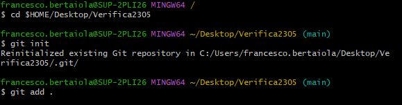
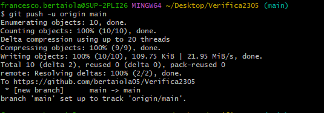
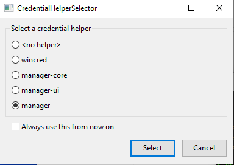
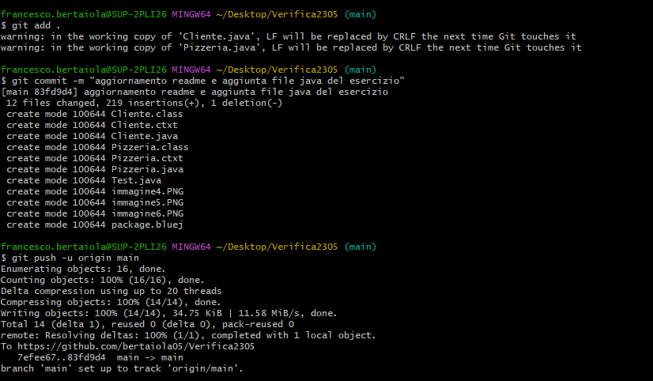
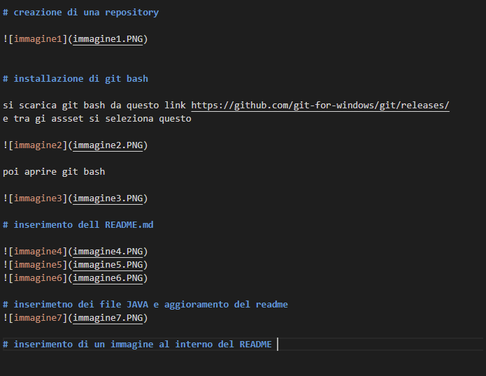

Una pizzeria da asporto intende gestire con un’applicazione java gli ordini e i clienti (username, email e indirizzo di consegna) che accedono per ordinare la pizza. Gli ordini devono essere rappresentati da un codice per poi essere rimossa alla consegna della pizza a casa del cliente.
Si scelga a seconda dei vantaggi e svantaggi quale sia la migliore modalità di gestione per le pizze da poter ordinare nell’applicazione e quale per i clienti.
●	aggiunta di un nuovo ordine;
●	ricerca dell’ordine in base al codice dell’ordine;
●	verifica dell’ordine della pizza con indicazione dei dati del cliente che lo ha preso;
●	rimozione di ordine.

# creazione di una repository

# installazione di git bash

si scarica git bash da questo link https://github.com/git-for-windows/git/releases/
e tra gi assset si seleziona questo 

poi aprire git bash

# inserimento dell README.md 

selezionare ciò che ci risulta più comodo
# inserimetno dei file JAVA e aggioramento del readme 

# inserimento di un immagine al interno del README 

# inserimento di un titolo 
digitare il caratter e "#" dare uno spazio e scirvere il titolo come visto nel immagine sopra
